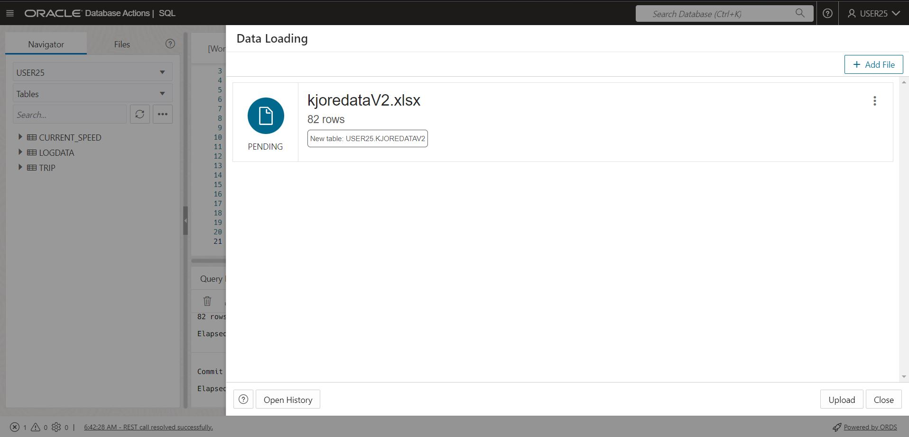
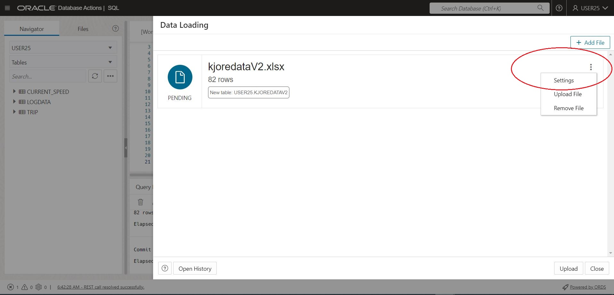
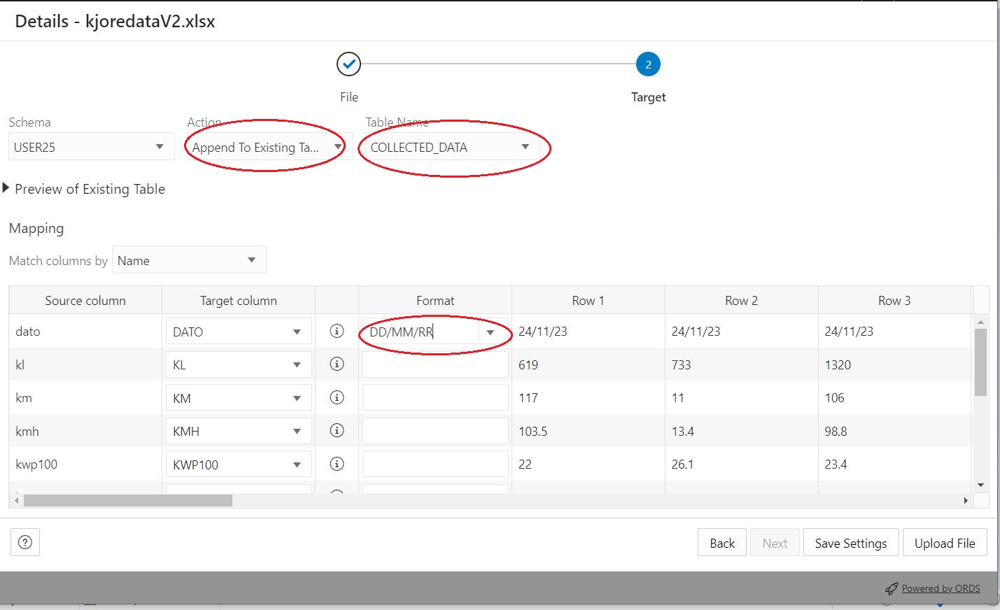
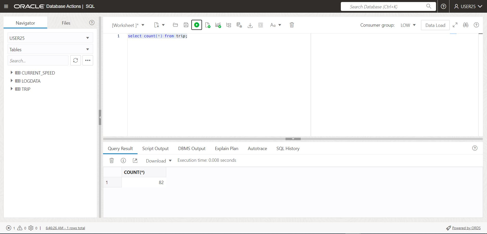

# Dataload, load trainingdata from Excel with Database actions  

There are two wasys of loading data into the trip table:  
- WIth the dataloader from excel
- By SQL from preseeded table. Use this option in case you won't spend to much time of the excel part of the lab

Navigate to Database Actions and click on data load


Drag and drop kjoredataV2.xlsx into the file area, and click on upload



Select settings



Accept defaults an click next


Change to load into existing table trip, correct date format, save settings



Run the upload


Upload completed without errors, verify number of rows, 82 rows should be loaded into trip



### Load from preseeded table

Execute the following commands from SQL Developer if the trip table exists:   
```
truncate table trip;
insert into trip (select * from workshop_trip);
commit;
```
  
If the trip table do not exists, just use CTAS:  

```
create table trip as select * from workshop_trip;
```


