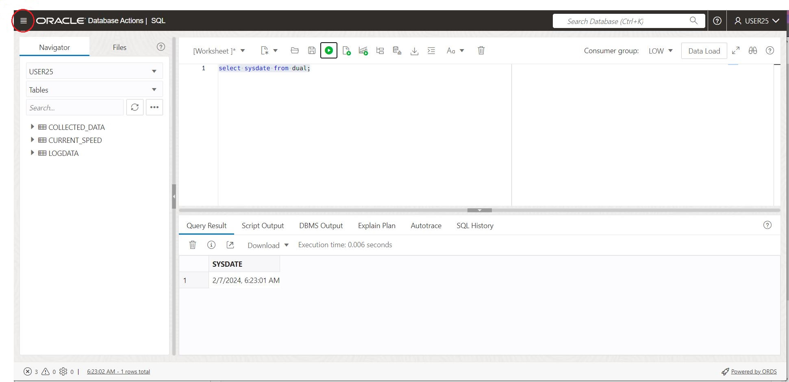
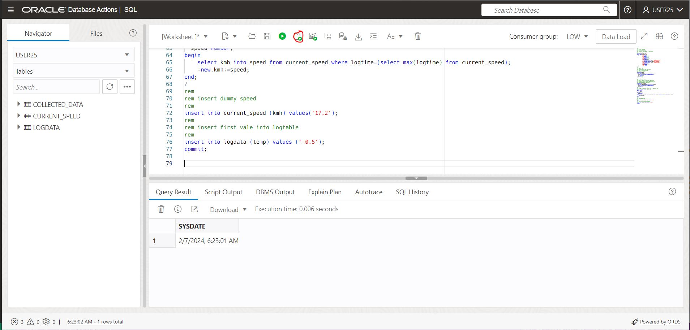

# Lab 1 instructions

## Purpose of lab

The purpose of this lab is to start testing Autonomous database Actions, aka dbactions,  
create the tables required and upload historical data for ML processing

## Prerequsite

You will get username, password and URL to the autonomous database from the instructor  

## Instructions

Assume your userid is user25 and your password is password25.  
  
With the URL to Autnomous like : https://myautonomous.adb.eu-frankfurt-1.oraclecloudapps.com 
The formal structure of the URL to database actions is:  

`https://<URL to autnomous>/ords/<dbusername>/_sdw/?nav=worksheet`

The URL to database actions, with SQL, ML and ORDS in this example will be:  
  
`https://myautonomous.adb.eu-frankfurt-1.oraclecloudapps.com/ords/demosuer03/_sdw/?nav=worksheet`

3 tables are needed for the labs:  
 - trip  the data collection used for Machine Learning
- logdata         datacolletion from "car" aka device
- current_speed   The device used in the lab only collects temp. When inserting into logd data if kmh is missing, the insert will fetch from current_speed

Logon and navigate to SQL:  

Download the script create_tables.sql and run it from dbactions, either by copy/paste into 
sql area and run script, or run from the file    
  

## Upload training data for machine learning

Locate the file kjoredataV2.xlsx on your cloned git repo

Run the instructions from 