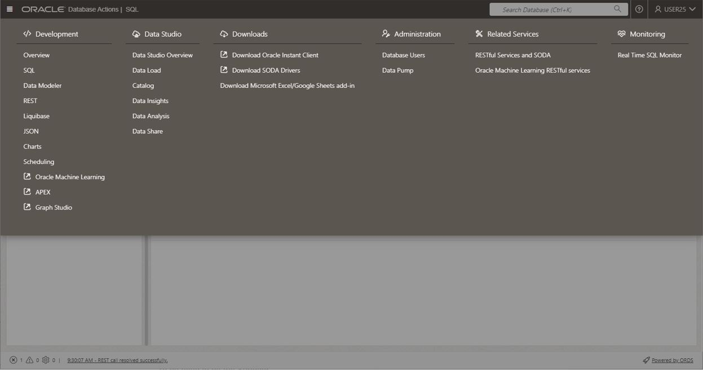
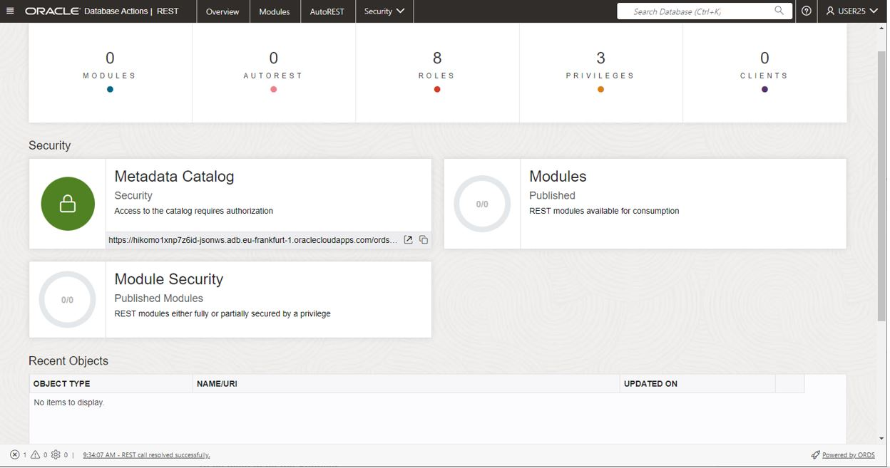
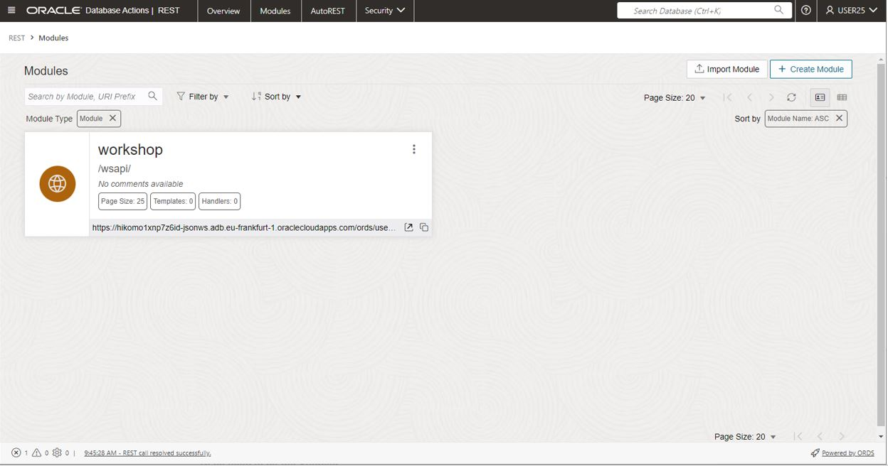
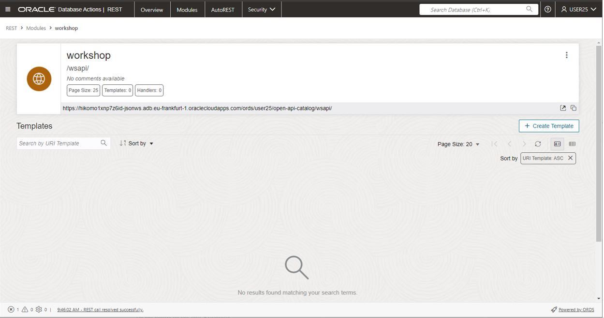
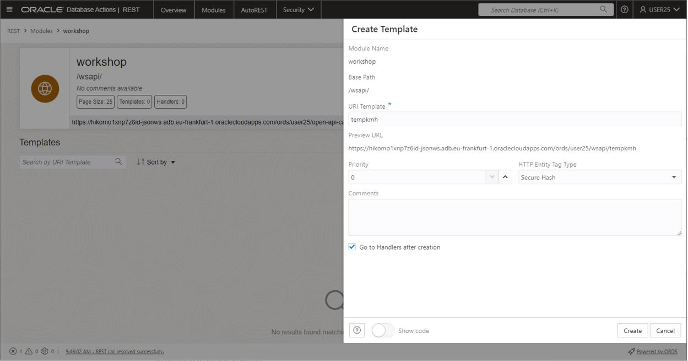
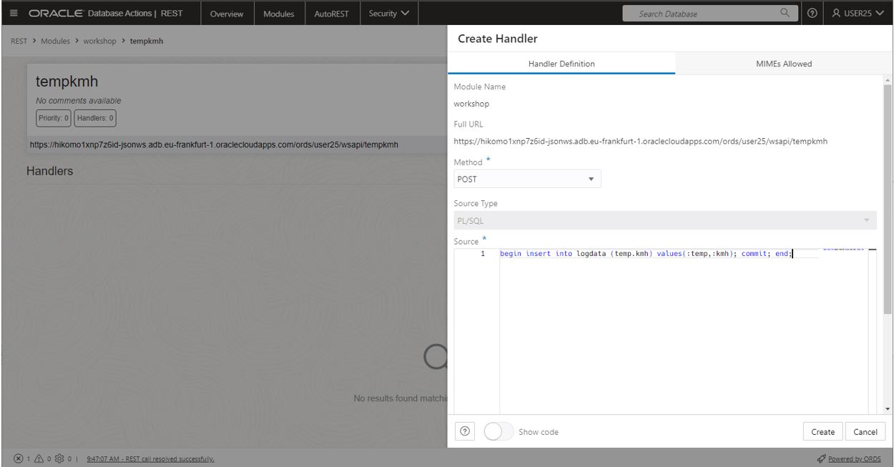
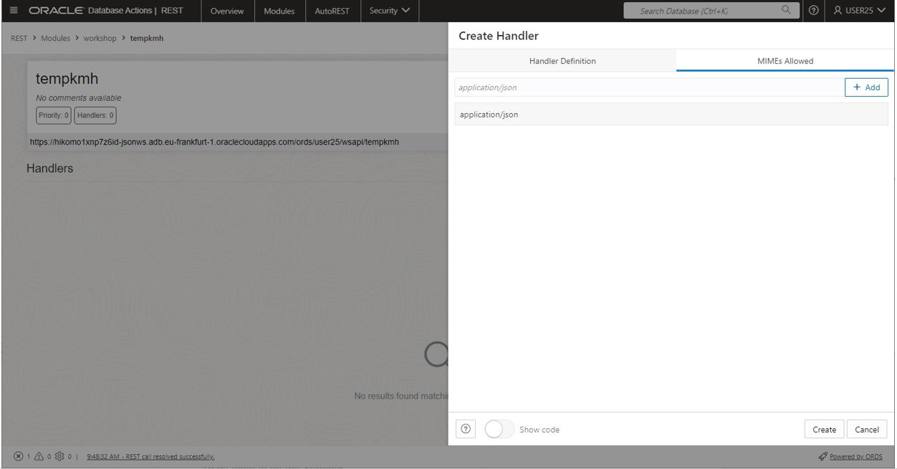
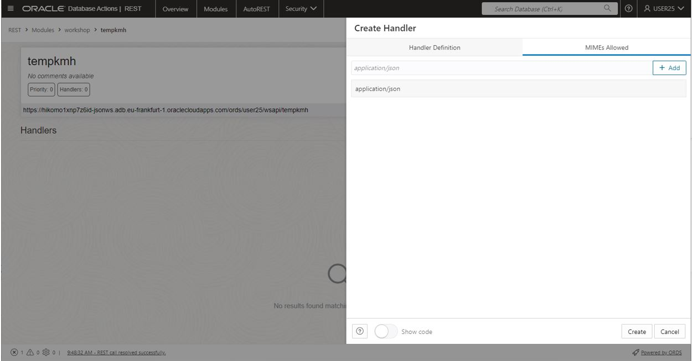
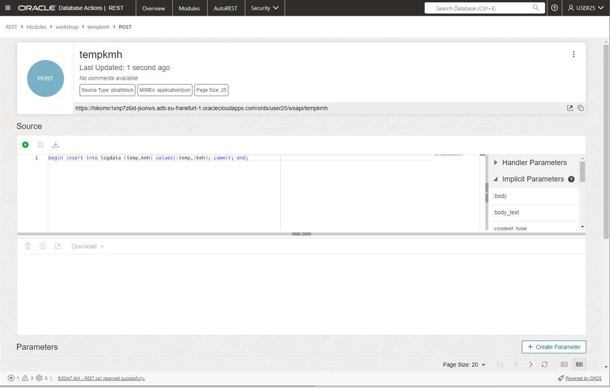

# Lab 3 instructions

## Purpose of lab

The prprose of this lab is to enavle ORDS API.
The lab will create the follwoing API

POST /wsapi/tempkmh    insert into logdata, payload: '{kmh:<current speed>,"temp":<current temp>}'
POST /wsapi/temp    insert into logdata, payload: '{"temp":<current temp>}', the API adds latest value from current_speed as defautl value for kmh
POST /wsapi/kmh    insert into current_speed, payload: '{kmh:<current speed>}' insert new defalt vale for speed, to be consumed by /wsapi/temp
GET /wsapi/tempkmh  fetches 25 latest records in teh logdata table

## Prerequsite

Complete lab 1

## Instructions

Copy/paste the script create_ords into dbactions, SL and run as script, or du the interactive lab

## Verifications
  
The ORDS API can be verified with the verify_ords.sql script  
Edit the script and add your autonomous URL and your username

## Interactive instructions

Create ORDS module
Navigate to the ORDS screen in dbactions  

Slect modules from top menu  

  
Clik crate module, enter name "workshop", leave the rest, click create  

  
Module created  

  
Click on "create teplate"  

  
Enter Template name "tempkmh", click create  

  
Select create handler, select POST and add PL/SQL statement  

'begin insert into logdata (temp,kmh) values(:temp,:kmh); commit; end;
  
  
Select on MIMEs Allowed  

  
Well done, first API created  

