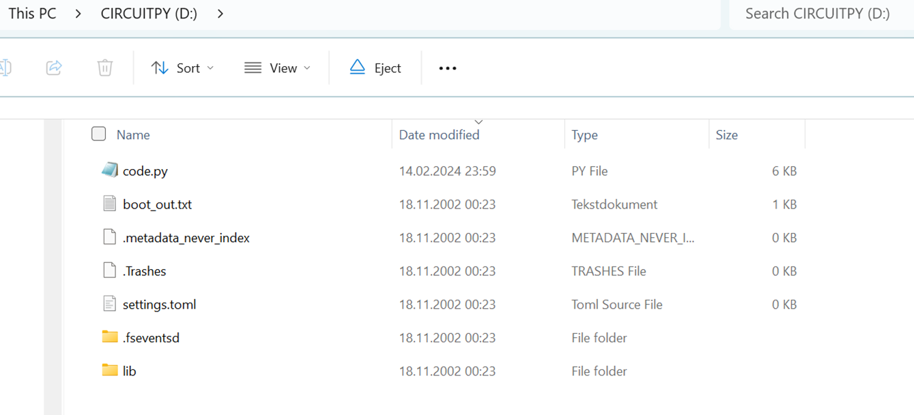
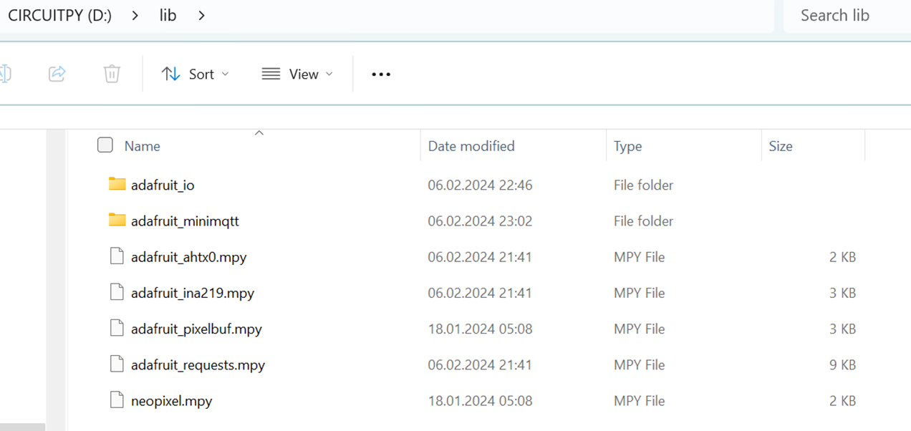
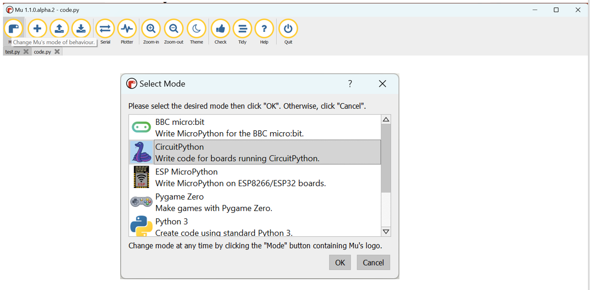
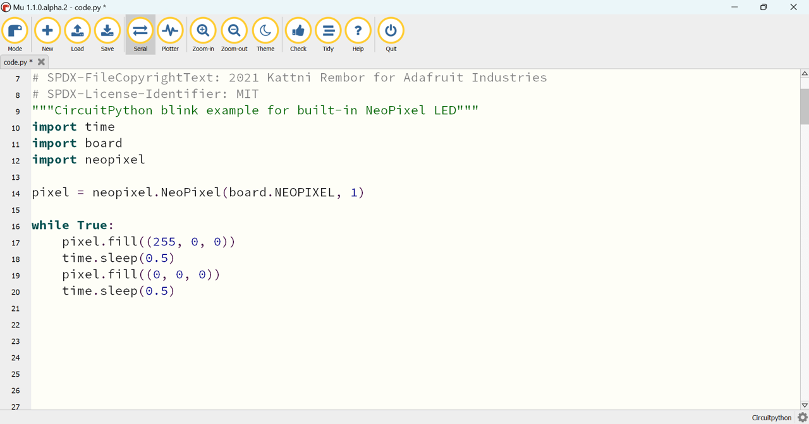
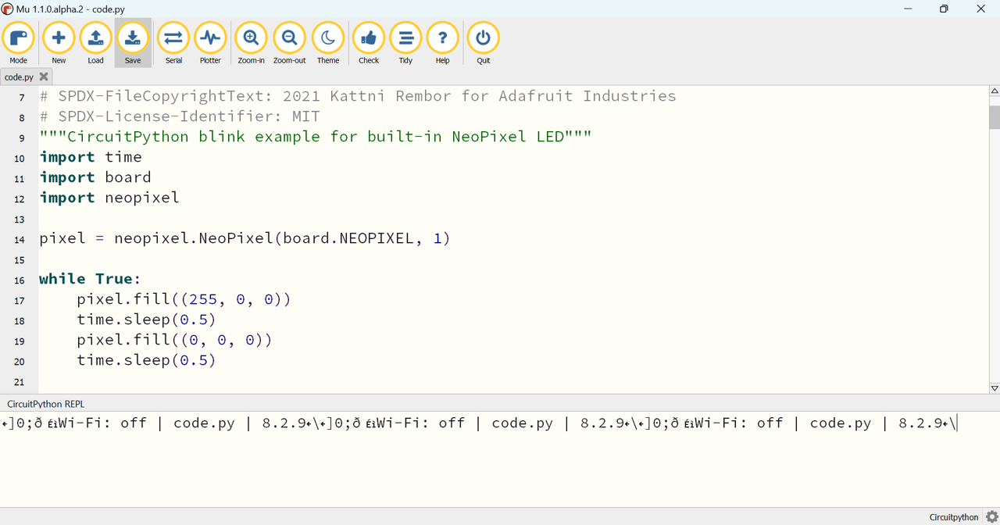

# Lab 4 (Microcontroller) instructions  


## Purpose of lab

The purpose of this lab is:
- Get a basic understanding and prepare the Circuitpython environment on the ESP32 Microcontroller.
- Configure and run the program that post temperatures to the database

## Prerequisite

For the lab you will get an ESP32 Microcontroller, an AHT20 Temperature and Humidity Sensor, and a small I2C (Inter Integrated Circuit) -cable, to connect them together.  

You will need a USB-C data cable for use between your Laptop/Mac and the USB C plug on the ESP32 board. 

## Instructions

Unpack both boards. Try not to touch the 3x3 mm blank sensor - it will hurt its accuracy if you do. 

## Step 1 - Hardware
 
The small cable and plugs is easy to damage so, first look at cable and identify the small blank metal pins on the plugs.  Locate the AHT20 text on the sensor-board and with the text oriented in the correct way - Carefully plug one end of the cable into the left white sockets - with the metal pins pointing down.  Then plug the other end into the white socket of the ESP32 controller.

The two plugs on the AHT20 sensor is actually identical, and can be used to daisy chain multiple sensor.  To reduce failure rate of the cable sockets, try to not remove cable from ESP32.  It is better to unplug at the AHT20 because you have two sockets - one spare if it gets damaged.  

## Step 2 - Download Circuitpython and prepare microcontroller

Download Adafruit Circuitpython library pack version 8.x from:  

[https://circuitpython.org/libraries](https://circuitpython.org/libraries)

Download Circuitpython 8 for Adafruit QT PYESP32-S2, the download.uf2 file, from:  

[https://circuitpython.org/board/adafruit_qtpy_esp32s2/](https://circuitpython.org/board/adafruit_qtpy_esp32s2/)


### Download ESP32 software bundle from GitHub???????  

Plug the USB cable into Laptop and ESP32 controller.  
The LED lamp on the ESP32 will start displaying different colors.  
You should now get a new USB drive on your Laptop.  
Look at the picture of the ESP32 and identify the boot button inside the red rectangle.  
Put the ESP32 into boot mode by double clicking the button two times with approx. 1 second between.  If successful LED lamp turns Green.  If not - retry until successful.  
A new drive will appear on your laptop.  

copy `adafruit-circuitpython-adafruit_qtpy_esp32s2-en_US-8.2.10.uf2` to the new drive.
You will probably get an error message when the ESP32 reboot with the new software.
You should now have a drive CIRCUITPY



Copy library files into lib directory on the new drive, from the bundle or from the zip file on GIT.



Locate the adafruitblink directory and copy code.py to CIRCUITPY top directory.  
The ESP32 should start blinking RED with a frequency of 1 HZ.  
  
## Step 3 - Download Micropython Development Environment and install it

For developing python code it is recommended to use MU development Environment, which can be downloaded from: 

[https://codewith.mu/en/download](https://codewith.mu/en/download)  

## Step 4 - Prepare and test MU for ESP32-S2

Start the MU environment - and select mode in upper left corner and the select CircuitPython  



paste the contents of  code.py from one of the blink directories from GIT into the upper window, and use save button to run it.  



use the serial button to open the output window - where all text from print commands will show up  
  
  
  
You can now get a little bit experience with the ESP32 Circuitpython by changing the RGB (Red Green Blue) parameters to values between 0 and 255.  Every time you save file, the ESP32 will run the new version of the program.  

You can also copy the lines with RGB and the following delay one or more times and change the colors and delays - to create more colorful blink sequences.  

The other blink directories also contains versions of code.py with different blink sequences.  

## Step 5 - Configure and start the micro_python_example.py from the sensor directory

Open [micro_python_example.py](../files/micro_python_example.py) program in the MU Developer Envrionment.


This program connects to a wifi network - use your phone or the network provider by your instructor.  
Program will then attempt to post temperature to the database.  

Before running you must change the wifi parameters and the uri to your database schema.  

Change this code to point to your ATP ORDS REST API:  
```

# Add the correct ATP ORDS REST URL
# Example format https://hirokixxx-mydb.adb.eu-frankfurt-1.oraclecloudapps.com/ords/demouser5/wsapi/temp

JSON_POST_URL = "https://<your ATP URL>/ords/<username>/wsapi/temp"

```

Change the WIFI connect parameters:  
 ```
 try:
	# change wifi SSID and PWD in next line
        ssid="MYSSID"
        pwd="MYPWD"
        wifi.radio.connect(ssid,pwd)
        connectWiFi = True
    except:
        print("\nConnect to network - failed")
```
Save the file to the ESP32, and you should see debug text in the lower window - while the LED will change colors while the program first tries to connect wifi, reads sensor, and then posts to the database.  

You can also use your breath to try to warm the sensor and see if you get a temperature change.  

If you unplug the I2C cable from the sensor, the program will go into a test mode where it will post a message with temperature 22c.  
You sometimes need to restart the ESP32 after plugging/unplugging by saving the Python program to the ESP32 - or pressing the restart button on the device.  

Look in the database - and see that you get a new post approx once every minute.  
Also identify the sequence of the LED colors while program is running and compare to text in MU.  
Leave the program running in MU.    

If the program crash - the led will start slow red blinking. and we can look for the error message in MU.  don’t close window - because this is info is necessary for improving the program.  
