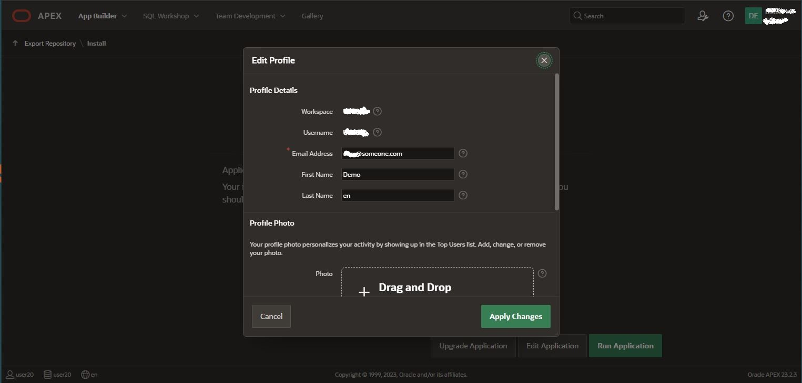

# Lab 5 instructions

## Purpose of lab

The purpose of this lab is to import and run the Oracle APEX application for viewing the trip- and log-data.

## Prerequsite

Completed lab 4  
You need to run the script [logdata_t.sql](..files/logdata_t,sql) from sqldeveloper prior to importing the application  

## APEX logon and URL  

The URL to the APEX Workspace is:  

`https://<your ATP instance>.adb.eu-frankfurt-1.oraclecloudapps.com/ords/r/apex/workspace-sign-in/oracle-apex-sign-in`  

** APEX username is in UPPERCASE **  
  

  
  

After first logon you will be asked to chnag eyour profile  
First Name  
Last Name  
Change the password. Minimum 12 Charaters with One Uppercase, digits and special Character  

  
  
## Build the Oracle APEX application

Go to the "App Builder" and choose the "Import" action.  

  
Drag and drop, or select the  file.    
  

Install the application  

Run the application  
