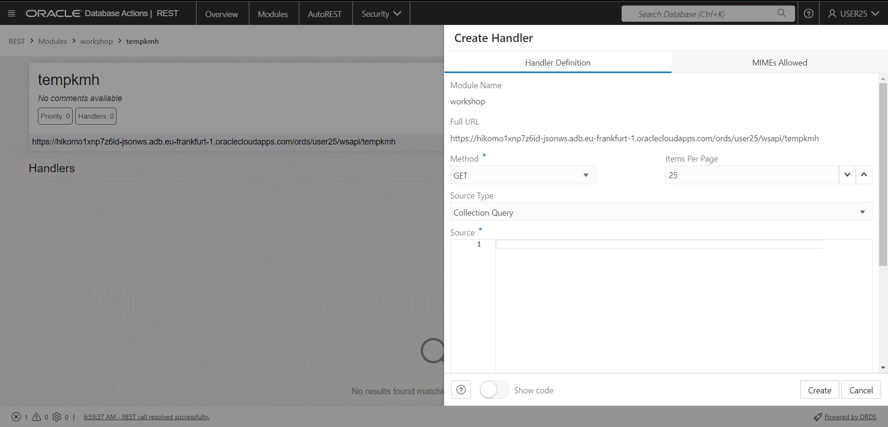
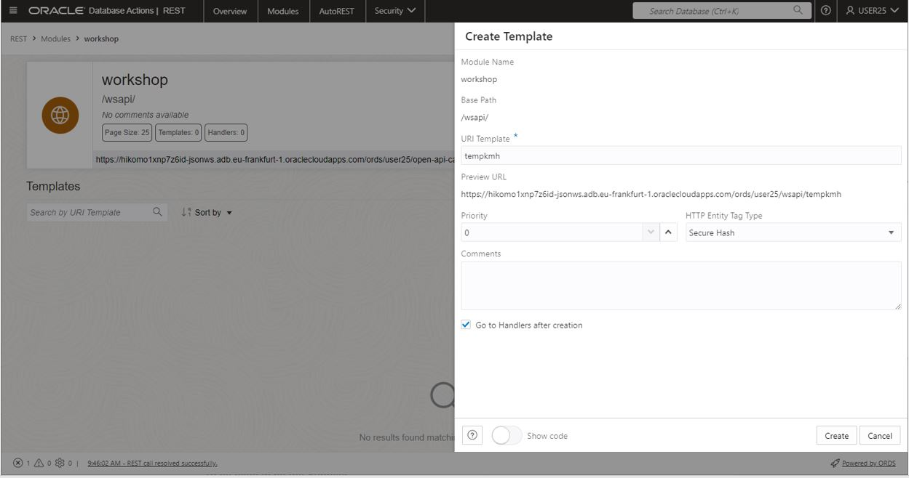
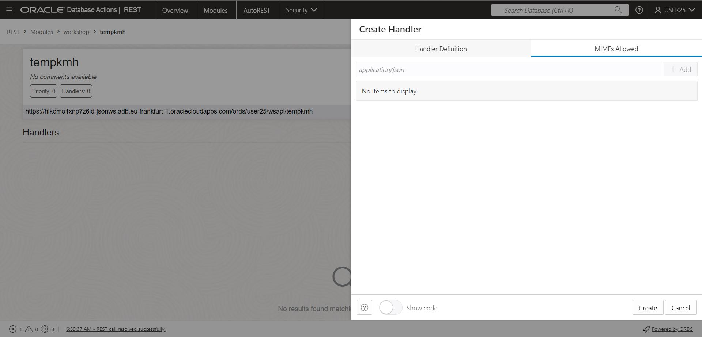
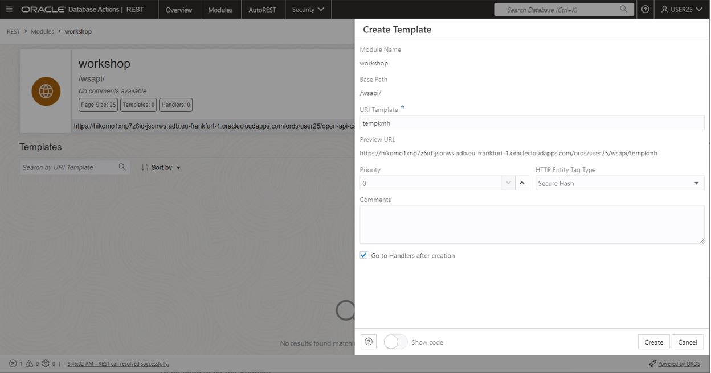
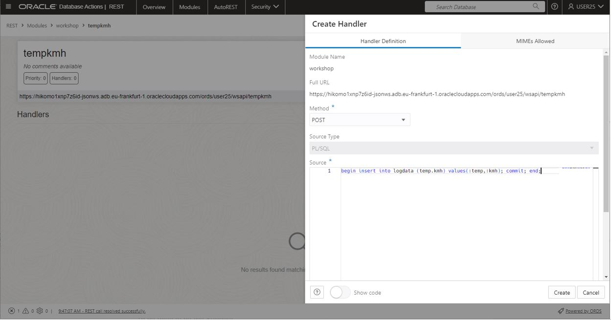
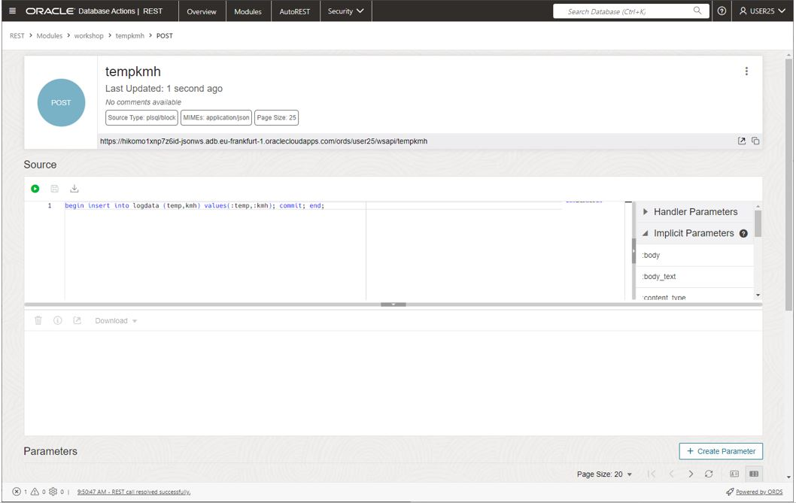

# Lab 3 instructions, Build ORDS REST API

## Build ORDS REST API with script

Copy/paste the script create_ords[create ords script](../files/create_ords.sql) into dbactions, and run as script, or do the interactive lab

## Interactive instructions, ORDS creation

Create ORDS module
Navigate to the ORDS screen in dbactions  

Select modules from top menu  

  
Clik create module, enter name "workshop", leave the rest, click create  

  
Module created, In the workshop title, select create template

You will now create the tempkmh REST API with POST  
Click on "create template"  

  
Enter Template name "tempkmh", click create  

  
Click create handler, select POST and add PL/SQL statement:  

`begin insert into logdata (temp,kmh) values(:temp,:kmh); commit; end;`  

 

Navigate to MIMEs allowed and select application/json and click add  
  

The first REST API handlers is complete

Well done, first API created, navigate back to "workshop"    
  

  
Repeat the steps for creating the temp REST API with POST  

Enter the PL/SQL below in the handler:  

`begin insert into logdata (temp) values(:temp); commit; end;` 

The REST API temp is added.  

  

Repeat the steps and add REST API kmh, POST. 
Add the following PL/SQL in the POST handler:  
`begin insert into current_speed (kmh) values(:kmh); commit; end;` 

The last REST API, preditct GET deviates a bit.  
This REST API select ad value with a PL/SQL having two input query parameters

Repeat the steps and add REST API predict, GET. 
Add the following PL/SQL in the POST handler:  
`begin :p_result:=predict_consumption(:p_kmh,:p_temp); end;` 

The GET REST API needs to define the return value from the PL/SQL function as a parameter  
Create the parameter:  

